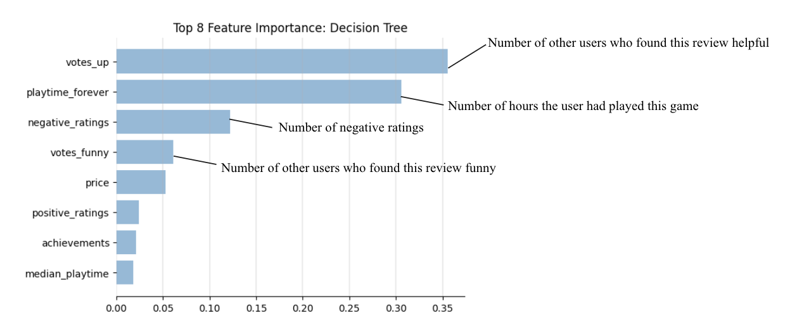

# Steam Game Analysis

## Intro

A project to study Steam games and user review data, involving classification, prediction and recommedation analysis. Our team members are Zhipeng Hong (zhong5@usfca.edu ), Haotian Gong (hgong12@usfca.edu), Zihao Ren (zren20@usfca.edu), Zhiyi Ren (zren15@usfca.edu) and Xinyue Wang (xwang241@usfca.edu). This project was done during University of San Francisco MSDS 2022 Distributed Data System.

Link to project presentation: [click here](https://github.com/ZhipengHong0123/Steam-Game-Analysis/blob/main/report/Group10_Slides.pdf)

 In this project, we created **MongoDB Atlas** and sharded the data into three clusters to improve the efficiency of reading and writing data. Then we created a data pipeline to access **20GB+** of raw data from **Amazon S3** and transferred the cleaned data to MongoDB Atlas. After performing data preprocessing, we loaded data from MongoDB Atlas and applied machine learning algorithms in a distributed system in **Databricks** using **Spark ML**.

## Motivation
With many extremely popular games on steam such as PUBG, Dota 2 and Counter Strike GO, all of which have religious followings, tens of thousands of reviews and high ratings. Using a data-driven approach, we wanted to explore the user preference and help game developers and game studios maximize the chances of success for their products. 

## Data Analytics Goals
- How we can segment steam reviewers and what their traits are using the K-means cluster.
- Figure out what features are important in determining whether steam players are more likely to 'voted up' a steam game and compare the performance of decision tree, logistic regression model and random forest.
- Provide game recommendations to each validation user using collaborative filtering by ALS model. 

-----
## Datasets

### Steam Review data: 

| Factor | DataType | Detail |
|--------|--------|--------|
| `steamID` | Numeric | the Steam user ID|
| **`appid`** | Numeric | the ID of the game being reviewed |
| `voted_up` | Boolean | True/False - true means it was a positive recommendation |
| `votes_up` | Numeric | the number of other users who found this review helpful |
| `votes_funny` | Numeric | the number of other users who found this review funny |
| `weighted_vote_score` | Numeric | helpfulness score |
| `playtime_forever` | Numeric | how many hours the user had played this game at retrieval |
| `playtime_at_review` | Numeric | how many hours the user had played the game when writing this review |
| `num_games_owned` | Numeric | the number of games this user owns |
| `num_reviews` | Numeric | the number of reviews this user has written |
| `review` | Text | the text of the written review |
| `unix_timestamp_created` | Timestamp | date the review was created (unix timestamp) |
| `unix_timestamp_updated` | Timestamp | date the review was last updated (unix timestamp) |

The dataset contains:
- 6,976,390 unique users
- 15,437,471 reviews
- 8,183 games reviewed


### Steam Games data:
 
| Factor | DataType | Detail |
|--------|--------|--------|
| **`appid`** | Numeric | the ID of the game |
| `name` | Text | video game name|
| `release_date` | Timestamp |release date of the game in format YYYY-MM-DD|
| `english`| Binary | 1 if is in English, 0 otherwise |
| `developer` | Text | name of developer(s) |
| `publisher` | Text | name of publisher(s) |
| `platforms` | Text | semicolon delimited list of supported platforms. At most includes: windows;mac;linux |
| `required_age` | Numeric | minimum required age according to PEGI UK standards |
| `categories` | Text | semicolon delimited list of game categories, e.g. single-player; multi-player
| `genres` | Text | semicolon delimited list of game genres, e.g. action; adventure |
| `achievements` | Numeric | number of in-games achievements |
| `positive_ratings` | Numeric | number of positive ratings |
| `negative_ratings` | Numeric | number of negative ratings |
| `average_playtime` | Numeric | average user playtime |
| `median_playtime` | Numeric | median user playtime |
| `owners` | Categorical | estimated number of owners. Contains lower and upper bound (like 20000-50000) |
| `price` | Numeric | current full price of title in GBP (Great Britain Pound) |

The dataset contains:
- 27,075 games info

# User Segmentation  

# Predictive Models
Predict Voted up.....
## Logistic Regeression  

## Decision Tree 

We trained a Decison Tree model to understand what features are important in determining whether steam players would prefer to 'voted up' a steam game. We performed data preprocessing such as identifing textual columns as categorical variables (`"StringIndexer`"), mapping categorical variables to columns of binary vectors (`"OneHotEncoder`") and combining the numerical features into a single vector column (`"VectorAssembler`") to formalize the data. We then used the `"DecisionTreeClassifier"` to train and fit the 80% data as the training set and controlled the `"maxDepth=10`".  Our feature importance graph is shown below:  


This graph indicated that the reviews those are more helpful/funny to other users tend to decide whether this review’s owner would recommend this game. It makes sense as if the user took it seriously to write the review, it might get many helpful/funny tags. Also, whether the user recommending a game corresponds to the number of hours user played the game and the number of negative ratings to the game. 
As the model evaluation accuracy is only 0.79 which did not meet our expectations，we did the cross validation process and grid searched the best model by trying 4 different `"maxDepth"` values. As the result, the accuracy score for the cross validation increased to 0.89.
```python
dt = DecisionTreeClassifier()
paramGrid = ParamGridBuilder().addGrid(dt.maxDepth, [5,10,15,20]).build()
evaluator = MulticlassClassificationEvaluator().setLabelCol("label").setPredictionCol("prediction")
 
cv = CrossValidator(estimator=dt, 
                    evaluator=evaluator, 
                    numFolds=5, 
                    estimatorParamMaps=paramGrid)
...
```

<table width="120">
<tbody>
<tr>
<td style="font-weight: 300;" colspan="3" width="120">Confusion&nbsp;Matrix</td>
</tr>
<tr>
<td>&nbsp;</td>
<td style="font-weight: 300;" width="53">Actually&nbsp;Positive&nbsp;(1)</td>
<td style="font-weight: 300;" width="51">Actually&nbsp;Negative&nbsp;(0)</td>
</tr>
<tr>
<td style="font-weight: 300;" width="51">Predicted&nbsp;Positive&nbsp;(1)</td>
<td style="font-weight: 300;" width="53"><b>1,963,084</b></td>
<td style="font-weight: 300;" width="51">39,070</td>
</tr>
<tr>
<td style="font-weight: 300;" width="51">Predicted&nbsp;Negative&nbsp;(0)</td>
<td style="font-weight: 300;" width="53">171,116</td>
<td style="font-weight: 300;" width="51"><b>85,241</b></td>
</tr>
</tbody>
</table>


## Random Forest  
We also built a Random Forest model to predict whether a user will vote up for a game. Since we have 100k+ rows, it's hard to implement Random Forest on all features. So we need to select the feature and use feature engineering to get more predictive features. So we choose `"appid"`,`"platforms"`,`"num_games_owned"`,`"num_reviews"`,`"developer"`,`"price"`,`"publisher"`,`"playtime_at_review"` and `"playtime_forever"` to predict `"voted_up"`. Since the review contains useful details, we defined a UDF funtion (user define function) which used **vaderSentiment**, a package in Python, to convert text into sentimental score in Spark Dataframe.   

We built Random Forest and used cross-validation to search for our best model.

```python
rf = RandomForestClassifier()
evaluator = BinaryClassificationEvaluator().setLabelCol("label").setMetricName("areaUnderPR")
paramGrid = ParamGridBuilder().addGrid(rf.maxDepth, [10,15]).addGrid(rf.maxBins, [6000]).addGrid(rf.numTrees,[10,15]).build()
 
cv = CrossValidator(estimator=rf, 
                    evaluator=evaluator, 
                    numFolds=3, 
                    estimatorParamMaps=paramGrid)
...
```
After fitting the model, we can get feature importance from Random Forest. The result shows that sentimental score is the model important feature in the model. Playtime, Developer, and Price are also important to predict Voted up. Then we tested the best model on the validation set, the accuracy is about 0.97.


## Model Comparison
<table width="743">
<tbody>
<tr>
<td style="font-weight: 400;" width="230">Model</td>
<td style="font-weight: 400;" width="234">Time</td>
<td style="font-weight: 400;" width="279">Validation&nbsp;Accuracy</td>
</tr>
<tr>
<td style="font-weight: 400;" width="230">Logistic&nbsp;Regeression</td>
<td style="font-weight: 400;" width="234">6&nbsp;min&nbsp;32&nbsp;secs</td>
<td style="font-weight: 400;" width="279">0.8424</td>
</tr>
<tr>
<td style="font-weight: 400;" width="230">Decision&nbsp;Tree</td>
<td style="font-weight: 400;" width="234">2&nbsp;hours&nbsp;23&nbsp;min&nbsp;15&nbsp;secs&nbsp;(4&nbsp;iterations&nbsp;of&nbsp;grid&nbsp;search)</td>
<td style="font-weight: 400;" width="279">0.8923</td>
</tr>
<tr>
<td style="font-weight: 400;" width="230"><b>Random&nbsp;Forest</b></td>
<td style="font-weight: 400;" width="234"><b>48&nbsp;min&nbsp;22&nbsp;secs</b></td>
<td style="font-weight: 400;" width="279"><b>0.974</b></td>
</tr>
</tbody>
</table>

# Game Recommendation
Commercial success of modern games hinges on player satisfaction and retention. So we did collaborative filtering recommendation via alternative least squares (ALS) algorithm. This Spark model only accepts user-item matrix for now (Year 2022), so we picked `"steamid"`,`"appid"`as user and item features, and treat `"voted-up"` as explicit rating.

To improve model perfermance, we decided to filter out cold starters and set thresholds:
1. Take off 'unpopular' games (less than 100 user rating)
2. Take off 'unfrequent' users (rated less than 10 games)

Also, we encoded steamid and appid with indexStringColumns to compress the data. And converted all data to integer to comply with the model setting.

```python
als = ALS(maxIter=5, regParam=0.01, userCol="steamid", 
          itemCol="appid", ratingCol="rating")
model = als.fit(df_training)
predictions = model.transform(df_test)
predictions = predictions.na.drop()
```

To evaluate the model perfermance, we picked RMSE with code below:
```python
evaluator = RegressionEvaluator(metricName="rmse", labelCol="rating",
                                predictionCol="prediction")
rmse = evaluator.evaluate(predictions)
print("Root-mean-square error = " + str(rmse))
```
A useful predictive model normally come with 0.2~0.5 RMSE, and you can use this metric to check the model effectiveness.

We finally leveraged the model to predict top 10 recommendated games to each user in the validation data set:
```python
userRecs = model.recommendForAllUsers(10)
userRecs.show()
```
