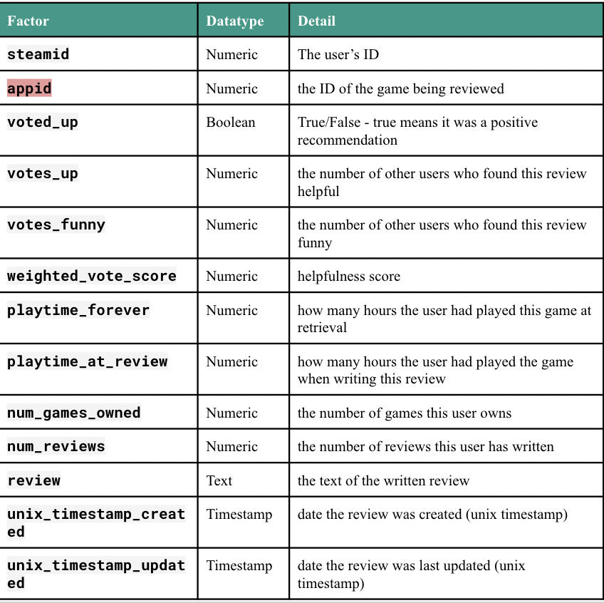

# Steam Game Analysis  
  
This is a team project to analyze steam games using Databricks. We created MongoDB Atlas and shard the data into three clusters which help improve our reading and writing data. Then we built a data pipeline to access **20GB+** raw data from Amazon S3 and transferred cleaned data into MongoDB Atlas. After we preprocess the data, we can load data from MongoDB Atlas and use **Spark ML** to applied Machine Learning Algorithm in the distributed system.  

-----
We have two different data:

* Steam Review data: Features about each review.  

| Factor | DataType | Detail |
|--------|--------|--------|
| SteamID| Numeric | Steam User ID|
|.......

  
  

* Steam Games data: contains features about the game.

  

# User Segmentation  

# Predictive Models
Predict Voted up.....
## Logistic Regeression  

## Decision Tree  

## Random Forest  
We also built Random Forest to predict whether a user will vote up for a game. Since we have 100k+ rows, it's hard to implement Random Forest on all features. So we need to select the feature and use feature engineering to get more predictive features. So we choose `"appid"`,`"platforms"`,`"num_games_owned"`,`"num_reviews"`,`"developer"`,`"price"`,`"publisher"`,`"playtime_at_review"` and `"playtime_forever"` to predict `"voted_up"`. Since the review also contains lots of information, we used **vaderSentiment** a package in Python that can convert text into the sentimental score. By defining a UDF function(user define function), we convert review context into the sentimental score in Spark Dataframe.   

We built Random Forest and used cross-validation to search for our best model.

```python
rf = RandomForestClassifier()
evaluator = BinaryClassificationEvaluator().setLabelCol("label").setMetricName("areaUnderPR")
paramGrid = ParamGridBuilder().addGrid(rf.maxDepth, [10,15]).addGrid(rf.maxBins, [6000]).addGrid(rf.numTrees,[10,15]).build()
 
cv = CrossValidator(estimator=rf, 
                    evaluator=evaluator, 
                    numFolds=3, 
                    estimatorParamMaps=paramGrid)
...
```
After fitting the model, we can get feature importance from Random Forest. The result shows that sentimental score is the model important feature in the model. Playtime, Developer, and Price are also important to predict Voted up. Then we tested the best model on the validation set, the accuracy is about 0.97.


## Comparing
| Model | Time | Detail |
|--------|--------|--------|
| Logistic Regeression| ... | ...|
| Decision Tree| ... | ...|
| Random Forest| ... | ...|


# Game Recommendation
